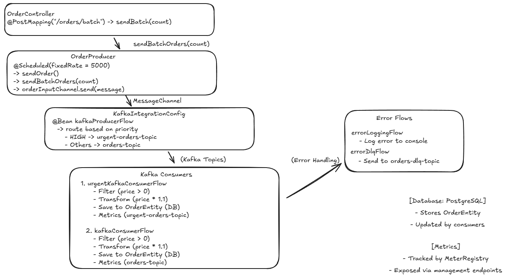

Kafka Spring Integration Demo
=============================

Este projeto é uma demonstração prática do uso do **Apache Kafka** com **Spring Integration** e **Spring Boot** (Java 21) para implementar um sistema de mensageria distribuída. Ele simula um cenário de e-commerce onde pedidos são gerados (produção), enviados para tópicos Kafka, processados por consumidores (com validação, transformação e persistência em um banco PostgreSQL), e monitorados via métricas. O ambiente é configurado com um cluster Kafka de três brokers, ZooKeeper, Kafdrop (para visualização) e PostgreSQL, tudo gerenciado por um arquivo `docker-compose.yml`.

Objetivo
--------

O projeto demonstra:

-   **Produção de mensagens**: Geração dinâmica de pedidos com dados realistas (usando `Faker`) e envio para tópicos Kafka.
-   **Consumo de mensagens**: Processamento de pedidos com validação, transformação (e.g., cálculo de impostos), e persistência no PostgreSQL.
-   **Escalabilidade**: Uso de grupos de consumidores e partições para processamento paralelo.
-   **Observabilidade**: Métricas de desempenho via Spring Boot Actuator e Prometheus.
-   **Ambiente completo**: Configuração de um cluster Kafka com réplicas e tolerância a falhas, além de uma interface web (Kafdrop) para inspeção.

Tecnologias Utilizadas
----------------------

-   **Java 21**: Linguagem principal.
-   **Spring Boot 3.3.4**: Framework para construção da aplicação.
-   **Spring Integration**: Para fluxos de integração com Kafka.
-   **Spring Kafka**: Para interação com o Kafka.
-   **PostgreSQL**: Banco de dados para persistência de pedidos.
-   **Apache Kafka**: Plataforma de streaming distribuído.
-   **ZooKeeper**: Gerenciamento de metadados do cluster Kafka.
-   **Kafdrop**: Interface web para visualizar tópicos e mensagens.
-   **Docker Compose**: Orquestração do ambiente (Kafka, ZooKeeper, PostgreSQL, Kafdrop).
-   **JavaFaker**: Geração de dados realistas para simulação.
-   **Spring Boot Actuator e Micrometer**: Para monitoramento e métricas.

Estrutura do Projeto
--------------------

```
kafka-spring-integration-demo/
├── src/
│   ├── main/
│   │   ├── java/com/example/kafka/
│   │   │   ├── Application.java
│   │   │   ├── config/KafkaIntegrationConfig.java
│   │   │   ├── model/
│   │   │   │   ├── Order.java
│   │   │   │   ├── OrderEntity.java
│   │   │   ├── producer/OrderProducer.java
│   │   │   ├── consumer/OrderConsumer.java
│   │   │   ├── repository/OrderRepository.java
│   │   │   ├── controller/OrderController.java
│   │   ├── resources/
│   │       ├── application.yml
├── pom.xml
├── docker-compose.yml
├── README.md

```



### Arquivos Principais

-   **`Application.java`**: Ponto de entrada da aplicação Spring Boot, com suporte a agendamento (`@EnableScheduling`).
-   **`KafkaIntegrationConfig.java`**: Configura fluxos de integração para produção (envio de mensagens ao Kafka) e consumo (leitura, validação, transformação e persistência).
-   **`Order.java`**: Modelo de dados para mensagens Kafka (JSON).
-   **`OrderEntity.java`**: Entidade JPA para persistência no PostgreSQL.
-   **`OrderProducer.java`**: Gera e envia pedidos dinamicamente a cada 5 segundos (usando `Faker`) ou sob demanda via endpoint REST.
-   **`OrderConsumer.java`**: Placeholder para lógica adicional de consumo (atualmente, o consumo é tratado no `KafkaIntegrationConfig`).
-   **`OrderRepository.java`**: Repositório JPA para salvar pedidos no PostgreSQL.
-   **`OrderController.java`**: Endpoint REST para enviar lotes de mensagens (`/orders/batch`).
-   **`application.yml`**: Configurações do Kafka, PostgreSQL e Actuator.
-   **`docker-compose.yml`**: Orquestra o cluster Kafka (3 brokers), ZooKeeper, Kafdrop e PostgreSQL.

Conceitos Fundamentais do Apache Kafka
--------------------------------------

Abaixo, uma explicação detalhada dos principais componentes do Kafka, para entender como o projeto os utiliza.

### 1\. **O que é Apache Kafka?**

Apache Kafka é uma plataforma de streaming distribuído que opera no modelo **publicação/assinatura** (publish/subscribe). Ele é projetado para processar grandes volumes de dados em tempo real, sendo escalável, tolerante a falhas e adequado para sistemas distribuídos, como pipelines de dados e comunicação entre microsserviços.

### 2\. **Componentes Principais**

#### a) **Produtores (Producers)**

-   **Definição**: Aplicações que enviam mensagens para tópicos Kafka. Cada mensagem é um par chave-valor, onde a chave é opcional e determina a partição de destino.
-   **Funcionamento**: Produtores se conectam aos brokers Kafka e publicam mensagens em tópicos. A partição é escolhida com base na chave (via hash) ou em um algoritmo round-robin (sem chave).
-   **Suporte**:
    -   **acks**: Nível de confirmação (`acks=1` para líder, `acks=all` para todas as réplicas).
    -   **retries**: Tentativas em caso de falha.
    -   **batch.size** e **linger.ms**: Para otimizar o envio em lotes.
-   **No projeto**: O `OrderProducer` envia mensagens JSON (pedidos) para os tópicos `orders-topic` e `urgent-orders-topic`, usando chaves para garantir consistência de partição.

#### b) **Consumidores (Consumers)**

-   **Definição**: Aplicações que assinam tópicos para ler mensagens, individualmente ou em grupos.
-   **Funcionamento**: Consumidores leem mensagens de partições específicas, rastreando sua posição com **offsets**. Podem começar do offset mais antigo (`earliest`) ou mais recente (`latest`).
-   **Suporte**:
    -   **Offset management**: Commit automático ou manual.
    -   **Rebalanceamento**: Redistribuição de partições em grupos.
-   **No projeto**: O fluxo de consumo no `KafkaIntegrationConfig` lê mensagens, valida (preço > 0), transforma (adiciona imposto) e salva no PostgreSQL.

#### c) **Grupos de Consumidores (Consumer Groups)**

-   **Definição**: Conjunto de consumidores que dividem as partições de um tópico para processamento paralelo. Cada partição é consumida por exatamente um consumidor no grupo.
-   **Funcionamento**:
    -   O Kafka atribui partições automaticamente via rebalanceamento.
    -   O `group-id` identifica o grupo e gerencia offsets.
    -   Consumidores excedentes (mais que o número de partições) ficam ociosos.
-   **Suporte**:
    -   **Escalabilidade**: Permite processar mensagens em paralelo.
    -   **Tolerância a falhas**: Reatribuição de partições em caso de falha.
-   **No projeto**: O grupo `orders-group` permite que múltiplas instâncias da aplicação consumam partições do `orders-topic` em paralelo.

#### d) **Partições**

-   **Definição**: Divisões lógicas de um tópico, permitindo escalabilidade e paralelismo. Cada partição é uma sequência ordenada de mensagens com offsets.
-   **Funcionamento**:
    -   Partições são hospedadas por brokers (um líder por partição, com réplicas em outros brokers).
    -   Mensagens com a mesma chave vão para a mesma partição, garantindo ordem.
-   **Suporte**:
    -   **Escalabilidade**: Mais partições aumentam o paralelismo.
    -   **Replicação**: Configurável via `replication.factor`.
    -   **Retenção**: Mensagens podem ser retidas por tempo ou tamanho.
-   **No projeto**: O tópico `orders-topic` tem 3 partições, permitindo até 3 consumidores processarem mensagens simultaneamente.

#### e) **Brokers**

-   **Definição**: Servidores que formam o cluster Kafka, armazenando partições e gerenciando requisições.
-   **Funcionamento**: Cada broker pode ser líder de algumas partições e seguidor de outras, com metadados gerenciados pelo ZooKeeper.
-   **Suporte**:
    -   **Tolerância a falhas**: Réplicas garantem disponibilidade.
    -   **Escalabilidade**: Brokers podem ser adicionados dinamicamente.
-   **No projeto**: O cluster tem 3 brokers, configurados no `docker-compose.yml`.

#### f) **ZooKeeper**

-   **Definição**: Serviço de coordenação para gerenciar metadados do cluster (tópicos, partições, grupos de consumidores).
-   **Funcionamento**: Realiza eleição de líderes e sincroniza configurações.
-   **No projeto**: Uma instância do ZooKeeper é configurada no `docker-compose.yml`.

### 3\. **Como Tudo Funciona Junto?**

-   **Produção**: O `OrderProducer` gera pedidos dinâmicos (via `Faker`) e os envia para tópicos (`orders-topic` ou `urgent-orders-topic`) com base na prioridade.
-   **Armazenamento**: Mensagens são distribuídas em partições (3 por tópico), com réplicas em outros brokers.
-   **Consumo**: Consumidores no grupo `orders-group` leem partições em paralelo, validam mensagens, aplicam transformações e salvam no PostgreSQL.
-   **Rebalanceamento**: Se uma nova instância da aplicação for iniciada, o Kafka redistribui as partições.
-   **Observabilidade**: Métricas (e.g., número de mensagens processadas) são expostas via Actuator/Prometheus.

Pré-requisitos
--------------

-   **Java 21**: Instalado localmente.
-   **Maven**: Para construir e executar o projeto.
-   **Docker e Docker Compose**: Para rodar o cluster Kafka, ZooKeeper, Kafdrop e PostgreSQL.
-   **Ferramentas opcionais**:
    -   **DBeaver** ou **pgAdmin**: Para inspecionar o banco PostgreSQL.
    -   **curl** ou **Postman**: Para testar o endpoint REST.
    -   **Prometheus** e **Grafana**: Para visualização de métricas (opcional).

Como Executar Localmente
------------------------

Siga os passos abaixo para executar o projeto:

### 1\. **Clone o Repositório**

```
git clone <URL_DO_REPOSITORIO>
cd kafka-spring-integration-demo

```

### 2\. **Inicie o Ambiente com Docker Compose**

O arquivo `docker-compose.yml` configura:

-   3 brokers Kafka (portas `19092`, `29092`, `39092`).
-   ZooKeeper (porta `2181`).
-   Kafdrop (porta `9000`).
-   PostgreSQL (porta `5432`, banco `orders_db`, usuário `user`, senha `password`).

Execute:

```
docker-compose up -d

```

Verifique os serviços:

-   Acesse o Kafdrop em `http://localhost:9000` para visualizar o cluster Kafka.
-   Conecte-se ao PostgreSQL via DBeaver/pgAdmin (`localhost:5432`, banco `orders_db`).

### 3\. **Construa e Execute a Aplicação**

Compile e inicie a aplicação Spring Boot:

```
mvn clean install
mvn spring-boot:run

```

A aplicação:

-   Cria os tópicos `orders-topic`, `urgent-orders-topic`, e `orders-dlq-topic` (3 partições, replicação 3).
-   Inicia o scheduler no `OrderProducer`, que gera pedidos a cada 5 segundos.
-   Consome mensagens, valida, transforma (adiciona 10% de imposto), e salva no PostgreSQL.

### 4\. **Teste o Envio de Lotes**

Use o endpoint REST para enviar um lote de mensagens:

```
curl -X POST http://localhost:8080/orders/batch?count=100

```

Isso envia 100 pedidos ao tópico `orders-topic` (ou `urgent-orders-topic` para pedidos com prioridade `HIGH`).

### 5\. **Observabilidade**

#### a) **Kafdrop**

-   Acesse `http://localhost:9000`.
-   Navegue até o tópico `orders-topic` ou `urgent-orders-topic`.
-   Verifique as mensagens em cada partição (0, 1, 2) e os offsets.
-   Inspecione o tópico `orders-dlq-topic` para mensagens inválidas (e.g., preço <= 0).

#### b) **PostgreSQL**

-   Conecte-se ao banco `orders_db` via DBeaver/pgAdmin.
-   Consulte a tabela `order_entity` para ver os pedidos salvos:

    ```
    SELECT * FROM order_entity;

    ```

-   Verifique os campos `order_id`, `product`, `price`, `timestamp`, e `priority`.

#### c) **Métricas (Actuator/Prometheus)**

-   Acesse `http://localhost:8080/actuator/prometheus` para ver métricas:
    -   `orders_processed_total`: Contador de mensagens processadas.
    -   `orders_processing_time_seconds`: Tempo de processamento por mensagem.
-   (Opcional) Configure Prometheus e Grafana:
    1.  Adicione um arquivo `prometheus.yml`:

        ```
        scrape_configs:
          - job_name: 'kafka-spring-integration-demo'
            metrics_path: '/actuator/prometheus'
            static_configs:
              - targets: ['host.docker.internal:8080']

        ```

    2.  Inicie o Prometheus:

        ```
        docker run -d -p 9090:9090 -v $(pwd)/prometheus.yml:/etc/prometheus/prometheus.yml prom/prometheus

        ```

    3.  Inicie o Grafana:

        ```
        docker run -d -p 3000:3000 grafana/grafana

        ```

    4.  Acesse `http://localhost:3000`, adicione o Prometheus como fonte de dados, e crie dashboards para visualizar `orders_processed_total` e `orders_processing_time_seconds`.

#### d) **Logs**

-   Verifique os logs da aplicação no console ou em um arquivo de log (se configurado).
-   Mensagens processadas são impressas com `System.out.println("Mensagem processada e salva: " + order)`.

### 6\. **Escalando Consumidores**

Para testar o paralelismo:

1.  Inicie múltiplas instâncias da aplicação em portas diferentes:

    ```
    mvn spring-boot:run -Dserver.port=8081
    mvn spring-boot:run -Dserver.port=8082

    ```

2.  Cada instância pertence ao grupo `orders-group`.
3.  O Kafka distribuirá as 3 partições do `orders-topic` entre as instâncias (máximo 3 consumidores ativos).
4.  Envie um lote de mensagens e observe no Kafdrop como as partições são consumidas.

Observabilidade e Monitoramento
-------------------------------

-   **Kafdrop**: Visualize tópicos, partições, mensagens e offsets em tempo real.
-   **PostgreSQL**: Monitore os dados persistidos para auditoria e análise.
-   **Actuator/Prometheus**: Acompanhe métricas de desempenho (mensagens processadas, tempo de processamento).
-   **Logs**: Inspecione os logs da aplicação para depuração.
-   **Cluster Kafka**:
    -   Verifique a saúde do cluster no Kafdrop (3 brokers ativos).
    -   Confirme a replicação (fator 3) e a distribuição de partições.
    -   Teste a tolerância a falhas parando um broker (`docker stop kafka-broker-2`) e observando o rebalanceamento.

Possíveis Melhorias
-------------------

-   **Reprocessamento de DLQ**: Adicione um consumidor para o tópico `orders-dlq-topic` para reprocessar mensagens inválidas.
-   **Autenticação/Segurança**: Configure SSL ou SASL no Kafka para ambientes de produção.
-   **Testes automatizados**: Adicione testes de integração com `@SpringBootTest` e `Testcontainers`.
-   **Integração com outros sistemas**: Encaminhe mensagens processadas para outro serviço (e.g., via REST ou outro tópico Kafka).

Solução de Problemas
--------------------

-   **Kafka não conecta**: Verifique se os brokers estão ativos (`docker ps`) e se o `bootstrap-servers` no `application.yml` está correto.
-   **PostgreSQL não acessível**: Confirme que o serviço `postgres` está rodando e que as credenciais no `application.yml` correspondem ao `docker-compose.yml`.
-   **Métricas não visíveis**: Acesse `http://localhost:8080/actuator/health` para verificar se o Actuator está ativo.
-   **Mensagens não aparecem no Kafdrop**: Confirme que o tópico foi criado e que o produtor está enviando mensagens.

Conclusão
---------

Este projeto oferece uma simulação realista de um sistema de mensageria com Kafka, Spring Integration e PostgreSQL. Ele demonstra os conceitos fundamentais do Kafka (produção, consumo, partições, grupos) e fornece uma base escalável para experimentação. Use o Kafdrop, PostgreSQL e métricas do Actuator para monitorar o sistema, e escale consumidores para testar o paralelismo.


